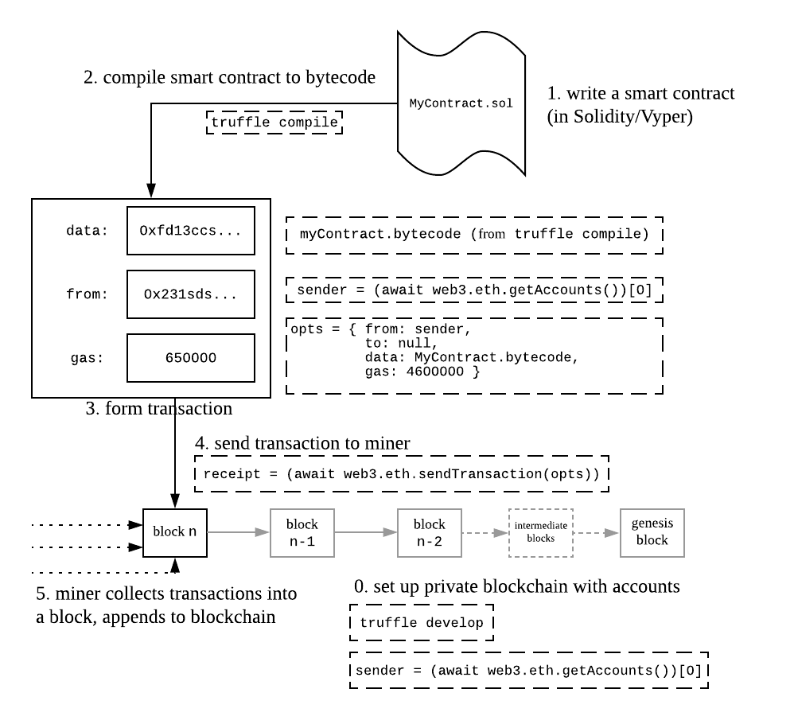

This tutorial was forked from [https://github.com/facuspagnuolo/ethereum-in-depth](https://github.com/facuspagnuolo/ethereum-in-depth) and updated to be compatible with Solidity v0.5. 

Refer to the article at [https://blog.zeppelin.solutions/ethereum-in-depth-part-1-968981e6f833](https://blog.zeppelin.solutions/ethereum-in-depth-part-1-968981e6f833) for a more narrative walkthrough. 

## Set up development environment

There are a few technical requirements before we start. Please install the following:

- [Node.js v6+ LTS and npm (comes with Node)](https://nodejs.org/en/)
- [Git](https://git-scm.com/)

Then, clone this repo and install its dependencies:

```
git clone https://github.com/therealyingtong/ethereum-in-depth
cd ethereum-in-depth
npm i
```

## Exercise 1: Contract creation
Go to the repo `cd 1-contract-creation`
Install dependencies `npm i`



### Compile and deploy a contract

```
truffle develop
truffle(develop)> compile
truffle(develop)> sender = (await web3.eth.getAccounts())[0]
truffle(develop)> opts = { from: sender, to: null, data: MyContract.bytecode, gas: 4600000 }
truffle(develop)> receipt = (await web3.eth.sendTransaction(opts))

```

We can check that our contract has been deployed successfully by running the following code:

```
truffle(develop)> myContract = new MyContract(receipt.contractAddress)
truffle(develop)> myContract.add(10, 2).then(r=>r.toString())
```

### Create a contract using another contract

```
truffle(develop)> opts = { from: sender, to: null, data: AnotherContract.bytecode, gas: 4600000 }
truffle(develop)> receipt = (await web3.eth.sendTransaction(opts))
truffle(develop)> anotherContract = (await AnotherContract.at(receipt.contractAddress))
truffle(develop)> anotherContract.myContract().then(a => myContractAddress = a)
truffle(develop)> myContract = (await MyContract.at(myContractAddress))
truffle(develop)> myContract.add(10, 2).then(r=>r.toString())

```

## Exercise 2: Message calls
Go to the repo `cd 2-message-calls`
Install dependencies `npm i`

### Forwarding a call

```
truffle develop
truffle(develop)> compile
truffle(develop)> Caller.new().then(i => caller = i)
truffle(develop)> opts = { gas: 4600000 }
truffle(develop)> caller.sendTransaction(opts).then(r => result = r)
truffle(develop)> logs = result.receipt.logs
truffle(develop)> parseInt(logs[0].args.gas) //4578955
truffle(develop)> parseInt(logs[1].args.gas) //71454
```

### delegatecall

#### Check Greeter contract

```
sender = (await web3.eth.getAccounts())[0]
truffle(develop)> ETH_2 = new web3.utils.BN('2e18')
truffle(develop)> Greeter.new().then(i => greeter = i)
truffle(develop)> opts = { from: sender, value: ETH_2 }
truffle(develop)> greeter.thanks(opts).then(tx => log = tx.logs[0])
truffle(develop)> log.event                     //Thanks
truffle(develop)> log.args.sender.toUpperCase() === sender.toUpperCase()   //true
truffle(develop)> log.args.value.eq(ETH_2)      //true
```

#### delegatecall 

##### Greeter method from Wallet contract: Let's confirm that delegatecall preserves the msg.value and msg.sender

```
truffle(develop)> Wallet.new().then(i => wallet = i)
truffle(develop)> wallet.sendTransaction(opts).then(r => tx = r)
truffle(develop)> logs = tx.receipt.rawLogs
truffle(develop)> SolidityEvent = require('web3/lib/web3/event.js')
truffle(develop)> Thanks = Object.values(Greeter.events)[0]
truffle(develop)> event = new SolidityEvent(null, Thanks, 0)
truffle(develop)> log = event.decode(logs[0])
truffle(develop)> log.event                    // Thanks
truffle(develop)> log.args.sender.toUpperCase() === sender.toUpperCase()  // true
truffle(develop)> log.args.value.eq(ETH_2)     // true
```

##### Addition and Product from Calculator contract: Let's confirm that the storage of the calling contract (Calculator) is the one being accessed by the executed code (in Addition and Product)

```
truffle(develop)> Calculator.new().then(i => calculator = i)
truffle(develop)> calculator.addition().then(a => additionAddress=a)
truffle(develop)> addition = (await Addition.at(additionAddress))
truffle(develop)> calculator.product().then(a => productAddress = a)
truffle(develop)> product = (await Product.at(productAddress))
truffle(develop)> calculator.add(5)
truffle(develop)> calculator.result().then(r => r.toString()) // 5
truffle(develop)> addition.result().then(r => r.toString())   // 0
truffle(develop)> product.result().then(r => r.toString())    // 0
truffle(develop)> calculator.mul(2)
truffle(develop)> calculator.result().then(r => r.toString()) // 10
truffle(develop)> addition.result().then(r => r.toString())   // 0
truffle(develop)> product.result().then(r => r.toString())    // 0
```

## Exercise 1: Data management
Go to the repo `cd 3-data-mangagement`
Install dependencies `npm i`

### Test inline assembly
```
truffle(develop)> compile
truffle(develop)> Calldata.new().then(i => calldata = i)
truffle(develop)> calldata.add(1, 6).then(r => r.toString())    // 7
```

### Try out storage
```
truffle(develop)> Storage.new().then(i => storage = i)
truffle(develop)> web3.eth.getStorageAt(storage.address, 0)  // 0x02
truffle(develop)> web3.eth.getStorageAt(storage.address, 1)  // 0x..
truffle(develop)> web3.eth.getStorageAt(storage.address, 2)  // 0x02
truffle(develop)> web3.eth.getStorageAt(storage.address, 3) 
// 0x00

truffle(develop)> mapIndex = ‘0000000000000000000000000000000000000000000000000000000000000003’

truffle(develop)> firstKey = ‘0000000000000000000000000000000000000000000000000000000000000001’

truffle(develop)> firstPosition = web3.utils.sha3(firstKey + mapIndex, { encoding: ‘hex’ })

truffle(develop)> web3.eth.getStorageAt(storage.address, firstPosition)
// 0x09

truffle(develop)> secondKey = ‘0000000000000000000000000000000000000000000000000000000000000002’

truffle(develop)> secondPosition = web3.utils.sha3(secondKey + mapIndex, { encoding: ‘hex’ })

truffle(develop)> web3.eth.getStorageAt(storage.address, secondPosition)
// 0x0A

```
